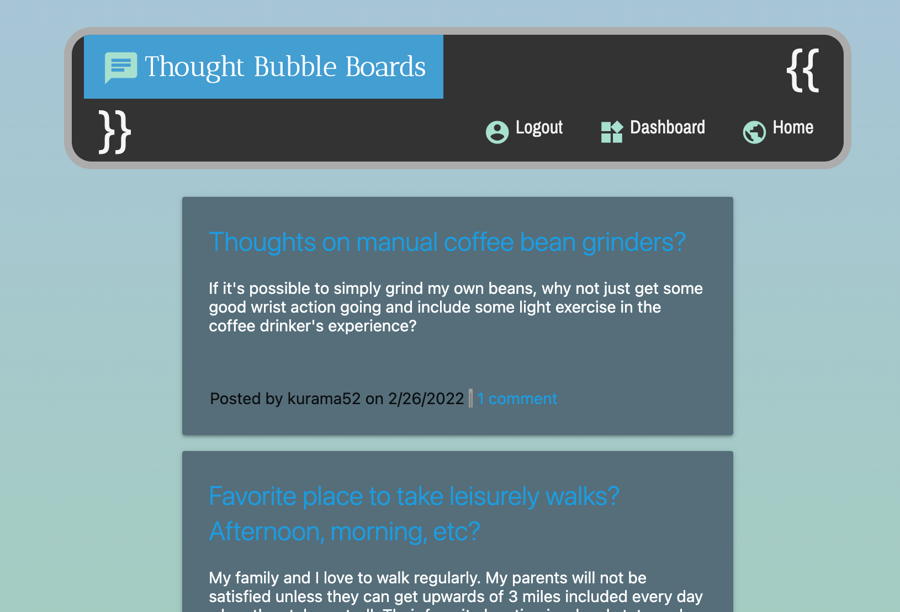

## thought-bubble-boards

## Usage
This is a message boards application built using Handlebars.js, MySQL2/Sequelize, Express.js/Session, and Heroku/JawsDB. The code includes RESTful API functionality with endpoints that relate to the Handlebars.js templates, using Session for auth. Posts can be viewed on the homepage without logging in, but to make posts and create comments the user must sign up.

## Installation
The app is available on Heroku at a link found below. Otherwise, make sure you have Node.js and MySQL installed. Next, run 'npm install' in the command prompt/terminal while navigated to the root directory to add the following dependencies.
```
bcrypt, connect-session-sequelize, dotenv, express, express-handlebars, express-session, mysql2, sequelize
```
Type in 'mysql -u root -p' while navigated to the root directory to activate the MySQL shell, then type 'source db/schema.sql' to create the source database. Now you should be set up to type in 'npm start' to run the server locally.

## Screenshot


## Deployed link
<a href="https://thought-bubble-boards.herokuapp.com/">Heroku page</a>
